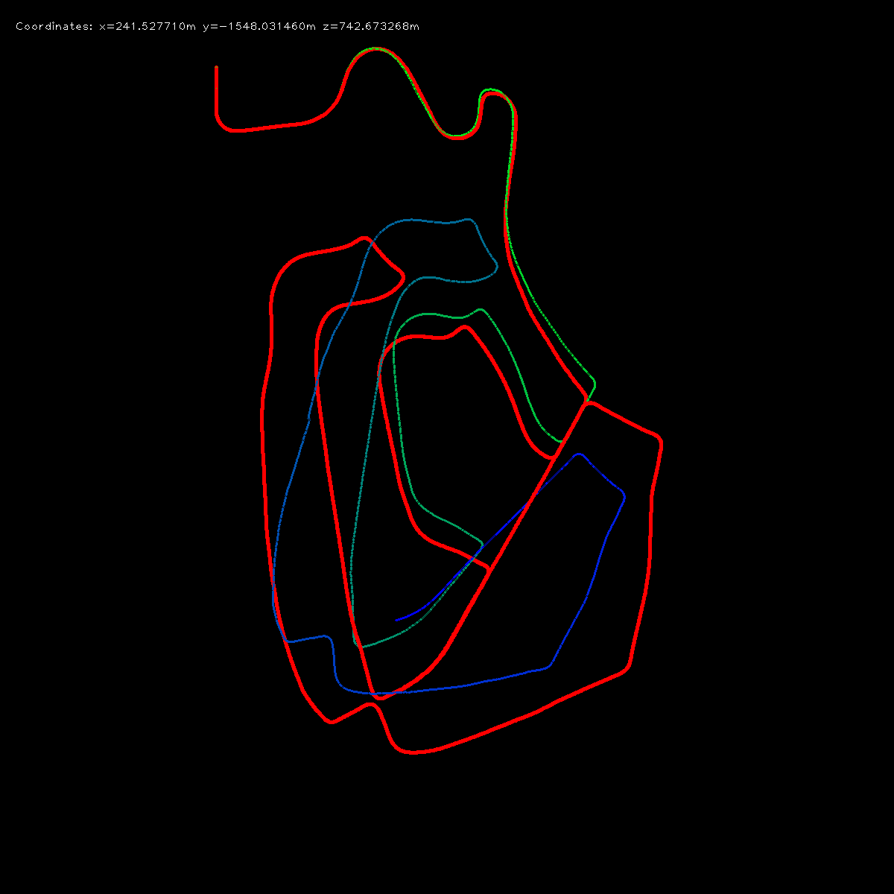

**Keywords:** FAST Feature Detection, LK Feature Tracking, Five-Point Motion Estimation

port from https://github.com/yueying/LearningVO



### Requirements
* Python 2.7
* Numpy
* OpenCV 3.2.0

### Dataset
 [KITTI odometry data set (grayscale, 22 GB)](http://www.cvlibs.net/datasets/kitti/eval_odometry.php)
 
### Usage
Modify the path in test.py to your image sequences and ground truth trajectories, then run
```
python test.py
```
